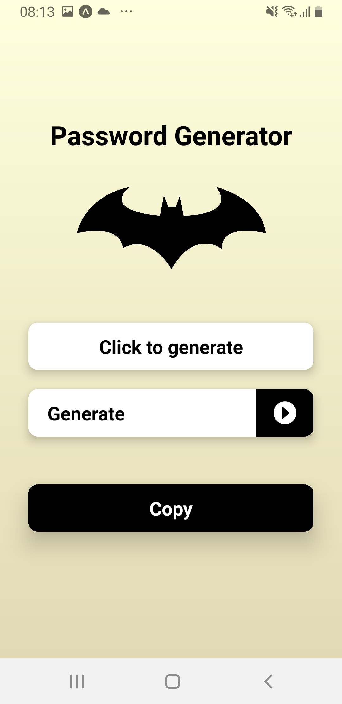

# Projeto Gerador de Senhas - Formação React Native Developer na DIO

## Sobre o Projeto

Este projeto foi desenvolvido como parte do desafio de formação para o curso de React Native Developer na Digital Innovation One (DIO). O objetivo era criar um aplicativo eficiente e fácil de usar para a geração de senhas seguras.

## Funcionalidades

- **Geração de Senha**: Permite ao usuário gerar uma senha aleatória com base em critérios específicos, como comprimento da senha e tipos de caracteres a serem incluídos (letras maiúsculas, minúsculas, números e símbolos).
- **Interface Intuitiva**: O aplicativo possui uma interface amigável e simples, facilitando a navegação e o uso por usuários de todos os níveis de habilidade.

## Tecnologias Utilizadas

- **React Native**: Utilizado para o desenvolvimento do aplicativo, permitindo uma experiência suave tanto em dispositivos Android quanto iOS.
- **JavaScript**: Linguagem de programação utilizada para implementar a lógica de geração de senhas e interações do usuário.

## Captura de Tela do Projeto

## Desenvolvido com ❤ por Matheus Chiodi 
